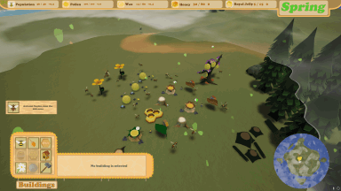
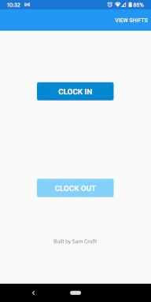

## Welcome to My Portfolio!

### About Me

I'm a keen, enthusiastic student with an itch for programming and passion for games!
Experienced with C/C++, C#, .NET, Unreal Engine & Unity.
Also have experience working with Networked systems & web applications using python, HTML, CSS, PHP & Javascript.

### My Projects
#### Feel free to click on the previews for more information.

|  Description  |      Preview     |  Download  | Source Code |
:--------------:|:----------------:|:----------:|:------------:
Hivernation - A Bee Themed RTS game. |  | [Download](https://drive.google.com/file/d/1WBfRyxU8ywNIHwzcUX3SOFy-uVb2Erfp/view?usp=sharing) | No source code yet!
Mobile Shift Tracker - Android app to track shift hours. |  | No Download | [Source Code](https://github.com/CritneySpears/MobileApp)
Super Runner - A Game jam with the theme "Super". |  | [Download](https://itch.io/jam/university-of-derby-spring-jam-2021/rate/974726) | [Link to Source Code](https://github.com/CritneySpears/UDoGameJamSpring2021)
Wave Defense Shooter - Survive against waves of enemies. |  | [Download](https://drive.google.com/file/d/1RjKAuBFPWLgRebiSxDUN_hGuezDJLJpv/view?usp=sharing) | No source code yet!
VR Training Sim - Simulation in VR demonstrating tool use. | | |
TopDownGame - A work in progress action RPG. | | |

