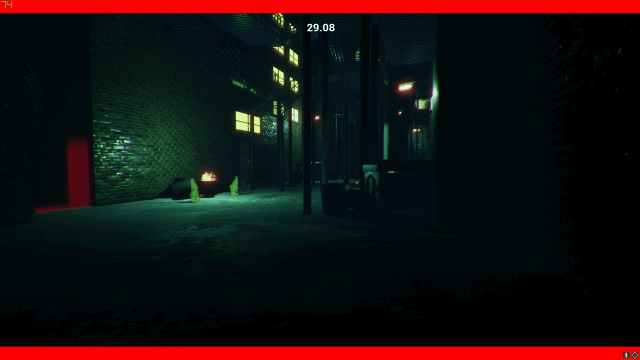
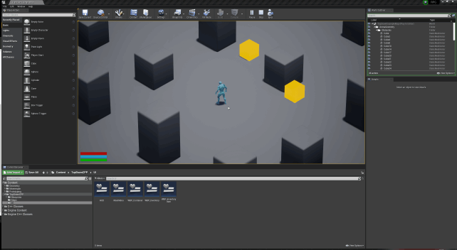

## Welcome to My Portfolio!

### About Me

I'm a keen, enthusiastic student with an itch for programming and passion for games!
Experienced with C/C++, C#, .NET, Unreal Engine & Unity.
Also have experience working with Networked systems & web applications using python, HTML, CSS, PHP & Javascript.

### My Projects

|  Description  |     Preview     |
:--------------:|:----------------:
Hivernation - A Bee Themed RTS game. [More...](Hivernation.md) | 
Mobile Shift Tracker - Android app to track shift hours. [More...](ShiftTracker.md) | 
Super Runner - A Game jam with the theme "Super". [More...](SuperRunner.md) | 
Wave Defense Shooter - Survive against waves of enemies. [More...](ShooterGame.md) | 
TopDownGame - A work in progress action RPG. [More...](TopDownGame.md) | 
VR Training Sim - Simulation in VR demonstrating tool use. | 

#### More to come!
Contact croft.sam77@gmail.com to get in touch!

