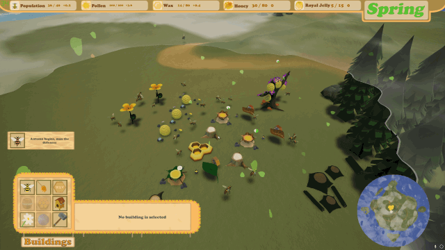

## Welcome to My Portfolio!

### About Me

I'm a keen, enthusiastic student with an itch for programming and passion for games!
Experienced with C/C++, C#, .NET, Unreal Engine & Unity.
Also have experience working with Networked systems & web applications using python, HTML, CSS, PHP & Javascript.

### My Projects

|   Description   |      Preview     |     Download     |   Source Code   |
:----------------:|:----------------:|:----------------:|:----------------:
Hivernation - A Bee Themed RTS game, a group project created in 15 weeks at University. |  | [Link to Download](https://drive.google.com/file/d/1WBfRyxU8ywNIHwzcUX3SOFy-uVb2Erfp/view?usp=sharing) | Sorry no source code available yet!
Mobile Shift Tracker - A simple android app to track your shift hours by "clocking" in and out. |  | No Download Link | [Link to Source Code](https://github.com/CritneySpears/MobileApp)

TopDownGame

Defend the Compound

Mobile App

VR Training Sim

Super Runner